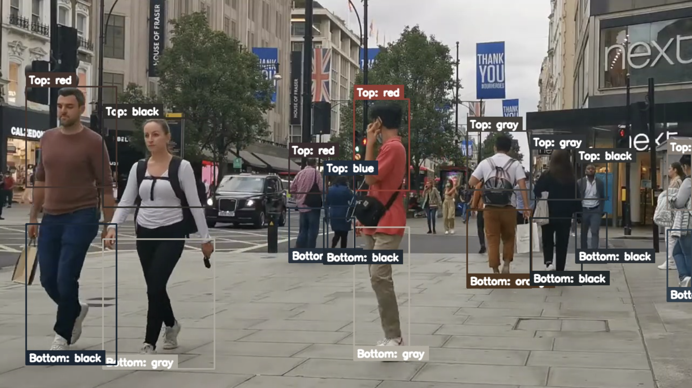

# Clothing Color Tracker

Detects people in a video, splits upper and lower body using pose keypoints, and labels the dominant colors for each region.  
Built with YOLOv8 (detection + pose), HSV-based color naming, and IOU tracking for temporal stability.

## Features
- YOLOv8 detection & pose estimation
- Upper/Lower body ROI extraction from keypoints
- HSV + KMeans color naming (configurable palette)
- Temporal smoothing & IOU tracking

## Quickstart
1. Create a Python 3.10+ environment.
2. Install dependencies:
   ```bash
   pip install -r requirements.txt
   ```
3. Launch Jupyter and open:
   ```bash
   src/main_notebook.ipynb
   ```
4. In the last cell, change the `input_path` to your own video path, e.g.:
   ```python
   process_video_colors_only(
       input_path="myvideo.mp4",
       output_path="output_colors.mp4",
       conf=0.40,
       scale=1.0,
       preview_every=15
   )
   ```

## Sample Output


## Notes
- Works best in good lighting conditions.
- Segmentation models (e.g., YOLOv8-seg) may improve clothing mask accuracy.

## License
MIT
